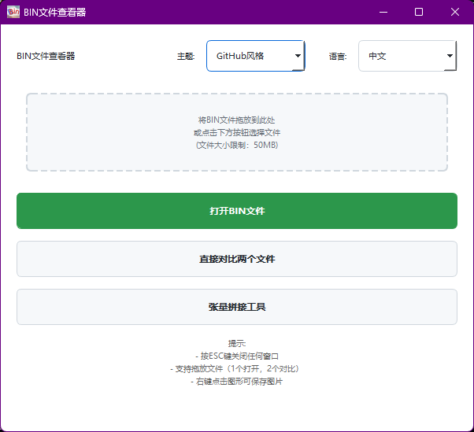
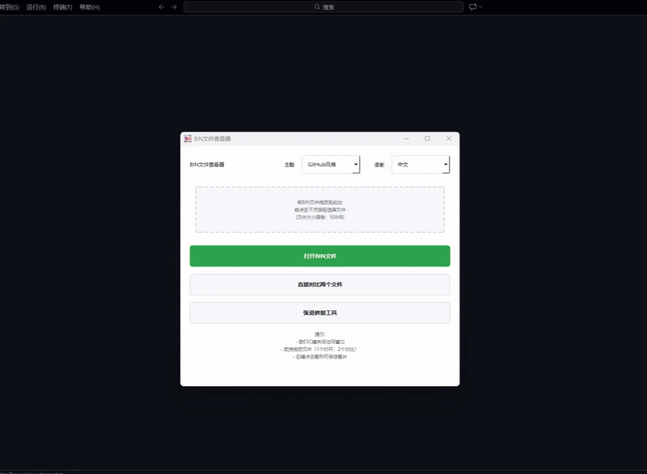

# BIN Viewer

一个用于可视化二进制文件的工具，主要用于算子开发和模型调试时对比 bin 文件的相似度。



## 项目背景

在开发深度学习算子时，经常需要对比模型输出的 bin 文件相似度、可视化中间层张量数据、拼接处理多个张量文件。为了提高调试效率，开发了这个小工具。

## 主要功能

- **单文件查看** - 可视化 bin 文件的波形数据
- **双文件对比** - 对比两个文件并计算相似度（Cosine、MSE、MAE）
- **张量拼接** - 支持多个 bin 文件的拼接操作
- **多主题/多语言** - 支持浅色/深色主题，中英文切换
- **交互操作** - 拖放文件、滚轮缩放、拖动平移、右键保存图片

## 快速开始

### 环境要求
- Python 3.8+

### 安装运行

```bash
pip install PyQt5 numpy matplotlib
python main.py
```

### 打包

```bash
pip install pyinstaller
pyinstaller main.spec
```

## 使用说明

### 基本操作
- 拖入 1 个 bin 文件 → 查看波形
- 拖入 2 个 bin 文件 → 自动对比
- 支持 int8、int16、float32 数据类型
- 右键保存图片（SVG/PDF/PNG/JPEG）

### 快捷键
- `ESC` - 关闭窗口
- `↑/↓` - 切换数据类型

### 演示



## 项目结构

```
binviewer/
├── main.py              # 程序入口
├── assets/              # 资源文件
│   ├── icons/          # 图标
│   ├── images/         # 图片
│   └── demo.mp4        # 演示视频
└── src/                 # 源代码
    ├── bin_viewer.py           # 主窗口
    ├── plot_window.py          # 波形窗口
    ├── comparison_window.py    # 对比窗口
    └── tensor_concat_window.py # 拼接工具
```

## 技术栈

- PyQt5 - GUI 框架
- NumPy - 数据处理
- Matplotlib - 数据可视化

## 致谢

本项目大部分代码由 AI 助手协助完成，特别感谢 Claude、豆包、Grok 等 AI 工具，极大提高了开发效率。

同时感谢 PyQt5、NumPy、Matplotlib 等开源项目。

## License

MIT License
